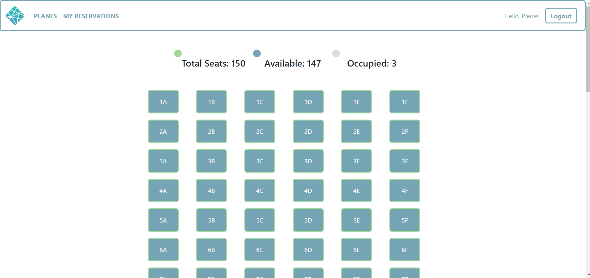
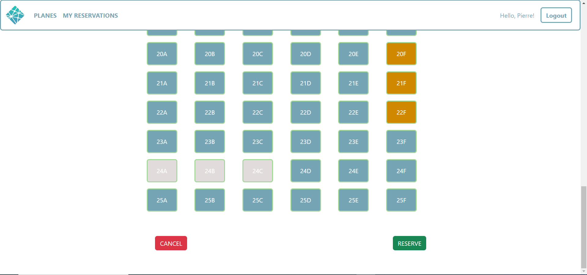

# Exam #2: "Airplane Seats"

## Student: s308705 FOFOU NGANGNIMAZE FRANKLIN ROOSEVELT

# Server side

## API Server

- POST `/api/login`: uses to login 
  - used to authenticate the user who is trying to login
  - request body content: email and password of the user who is trying to login
  - response body content: authenticated user, his `id, name, email, salt and cryptedpassword`
- GET `/api/login/current`:
  - used to check if current user is logged in and get part her data
  - response body content: the `id, name and email` of the authenticated user 
- GET `/api/logout`: uses to logout
- GET `/api/planes`: uses to retrieve all the planes
  - response body content the list of all planes (Plane objects)
- POST `/api/planes/:planeId/reservation`
  - used to create/add a new reservation to a specific user
  - request parameter : the ID of the current plane
  - request body content: the date of reservation and the plane type
  - response body content: the ID of the new reservation 
- GET `/api/reservations`
  - used to retrieve reservations
  - response body content: list of all reservations (Reservation Objects) of the specific user
- DELETE `/api/reservations/:reservationId`
  - used to delete a specific reservation
  - request parameter : the ID of the reservation to delete
  - response body content: Boolean value
- GET `/api/planes/:planeId/seats`:
  - used to retrieve the plane seats
  - request parameters : the ID of the plane
  - response body content: the list of all seats of the specified plane (ID)
- GET `/api/reservations/:reservationId/reservedseats`
  - used to retrieve the seats of a specific reservation
  - request parameters : the ID of the reservation
  - response body content: the list of all reserved seats of the specified reservation ID
- PUT `/api/planes/:planeId/seats/:seatId`: 
  - update an existing seat with new values (isReserved and reservationId are changed)
  - request parameters : the ID of the plane and the ID of the related seat to edit.
  - request body content: the seat code, the status(isReserved) and the ID of the related reservation
  - response body content: Boolean value

## Database Tables

- Table `user` - contains the users (objects) with the following attributs `(id, name, email, salt, cryptedPassword)`
- Table `seat` - contains the seats (objects) of all planes with the following attributs `(id, planeId, code, isReserved, reservationId)`
- Table `plane` - contains the planes (objects) with the following attributs `(id, type, numRows, numColumns)`
- Table `reservation` - contains all reservations (objects) with the following attributs `(id, date, planeId, planeType, user)`:user=>userIDD 

# Client side

## React Client Application Routes

- Route `/` or `index`: uses to browse to `ListOfPlanes` layout page where the planes are displayed.
- Route `/planes/:planeId/:planeType/:seatsRow`: used to browse to `AddReservationForm` layout where the user are able to choose seats to reserve.
- Route `/reservations`: used to navigate to `ListOfReservations` layout where reservations are displayed.
- Route `/login`: used to navigate to `LoginForm` layout where the user can sign in.
- Route `*`: uses to browse to `PageNotFound` layout where 404 message are displayed

## Main React Components

- `LoginForm` (in `Login.jsx`): layout used for the authentication
- `Navigation` (in `NavBar.jsx`): layout used to navigate between page
- `ListOfPlanes` (in `Planes.jsx`): layout used to display all the planes
- `ListOfReservations` (in `Reservations.jsx`): layout used to display the reservations
- `AddReservationForm` (in `AddReservation`): layout used to display the plane seats to handle an reservation using another child components from `AddReservationUtils`
- `NewReservation` (in `AddReservationUtils`): layout used to display only when one or more seats are requested and to validate seats from the requested state to the reserved seats
- `SeatStatusDisplay` (in `AddReservationUtils`): layout used to display the number of all seats, the numder of available and occupied seats
-`AlreadyReservedWarning` (in `AddReservationUtils`): layout used to trigger a popup when an user already has a reservation for the current plane

# Usage info

## Example Screenshot

## Users Credentials

Here you can find a list of the users already registered inside the provided database.

|         email       |   name   |      password       |
|---------------------|----------|---------------------|
| pierre@polito.it    | Pierre   | Pierre2             |
| jean@polito.it      | Jean     | Jean3               | 
| akitos@polito.it    | Akitos   | Akitos1             |
| Angelo@polito.it    | Angelo   | Angelo4             |
